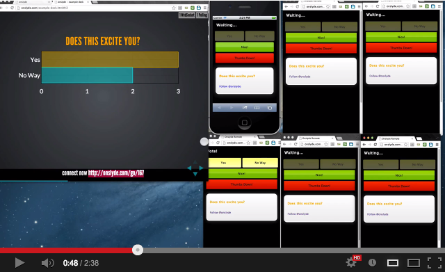

#Watch the video

[](http://www.youtube.com/watch?v=SidOO_hgSfI&hd=1)

#Details of onslyde
At its core, the concept is simple. Attendees connect to a server, the presenter sends them vote options at certain points during her presentation and whoever decides to connect can have anonymous interactions with the presenter. Participants may also give a "thumb up" or "thumb down" during any slide to show that they approve or disapprove of the content on a given slide. This allows for a very fine grained level of anonymous interaction.
 
Beyond the simplistic parts of interacting with the slide deck, I wanted the presenter to actually have the ability of tailoring their talk to the "collective wisdom" of the audience. So, the presenter has the ability of forking their slides and providing 2 tracks of content based on the audience vote. The poll and tracks are setup declaratively as follows:
```html
<section class="slide-group">
 
    <section class="slide" data-option="master">
        <h3 class="send">What is your favorite color?</h3>
    </section>
 
    <section class="slide" data-option="Blue">
        <div class="send">
            Blue is the one of the three additive primary colours and is the colour 
            of the clear sky and the deep sea on Earth. On the optical spectrum, blue 
            is located between violet and green.
        </div>
    </section>
 
    <section class="slide" data-option="Red">
        <div class="send">
            Red is the color of blood, rubies, and strawberries. Next to orange at 
            the end of the visible spectrum of light, red is commonly associated with 
            danger, sacrifice, passion, fire, beauty, blood, anger, socialism and 
            communism, and in China and many other cultures, with happiness.
        </div>
    </section>
    
    <section class="slide" data-option="Red">
        <div class="send">
            Red can stimulate hunger as well..
        </div>
    </section>
 
</section>
```

<ul>
<li><em>data-option="master"</em> : denotes a master slide where the bar graph will be displayed</li>
<li><em>data-option="Blue"</em> : is one of the 2 polling options</li>
<li><em>data-option="Red"</em> : is one of the 2 polling options, also notice that we have multiple "Red" sections. These slides will be presented
in order if "Red" wins the audience vote.</li>
<li><em>class="send"</em> : specifies that we want to send this content to each connected remote</li>
</ul>

<p>So, the above markup sets up the following slide deck and remote control options:
<a href="http://www.wesleyhales.com/images/posts/2013-02-25/onslyde-1.PNG"></a></p>

<p>After all the votes are placed, the winning track is chosen based on the majority vote:
<a href="http://www.wesleyhales.com//images/posts/2013-02-25/onslyde-2.PNG"></a></p>

<p>After the fork occurs, the presenter can choose to present slides in linear fashion, or ask another poll question. The framework is
limited by only allowing for 2 options to be given and slides can only be forked once per question.</p>

<p>As stated earlier, everything is declarative and setup through HTML markup. So there's no need for the presenter to setup a server or mess
with JavaScript. The deck can work without an internet connection as a fallback, or you could run the server on your laptop and bring
a router/hotspot for the audience to connect to.</p>

Please see the complete site at <http://onslyde.com/>.  
Or, read [this post](http://wesleyhales.com/blog/2013/02/25/How-Collective-Wisdom-Shapes-a-Talk/) for the full history.

#In the wild
Here is a presentation from February 2013 where onslyde was used:
http://www.youtube.com/watch?v=n-7Xu75T2bU

*Points in the talk where the audience voted:*
* <a href="http://www.youtube.com/watch?feature=player_detailpage&amp;v=n-7Xu75T2bU#t=101s">Vote 1</a>
* <a href="http://www.youtube.com/watch?feature=player_detailpage&amp;v=n-7Xu75T2bU#t=583s">Vote 2</a>
* <a href="http://www.youtube.com/watch?feature=player_detailpage&amp;v=n-7Xu75T2bU#t=1571s">Vote 3</a>
* <a href="http://www.youtube.com/watch?feature=player_detailpage&amp;v=n-7Xu75T2bU#t=1762s">Vote 4</a>
* <a href="http://www.youtube.com/watch?feature=player_detailpage&amp;v=n-7Xu75T2bU#t=3451s">Vote 5</a>

#Start presenting
<ul>
<li><a href="http://onslyde.com" target="_blank">Signup here</a>, login, and go to "Getting Started".</li>
</ul>

#Supported Browsers
The slide deck currently has only been tested with Chrome. 
The audience remote controls have been tested on many mobile browsers.

#Custom Remote
Feel free to rebrand the remote for the audience with your twitter handle etc... Send a pull request and I'll add it. 

# License

    Copyright (c) 2012-2013 Wesley Hales and contributors (see git log)

    Permission is hereby granted, free of charge, to any person obtaining a copy
    of this software and associated documentation files (the "Software"), to
    deal in the Software without restriction, including without limitation the
    rights to use, copy, modify, merge, publish, distribute, sublicense, and/or
    sell copies of the Software, and to permit persons to whom the Software is
    furnished to do so, subject to the following conditions:
      
    The above copyright notice and this permission notice shall be included in
    all copies or substantial portions of the Software.
       
    THE SOFTWARE IS PROVIDED "AS IS", WITHOUT WARRANTY OF ANY KIND, EXPRESS OR
    IMPLIED, INCLUDING BUT NOT LIMITED TO THE WARRANTIES OF MERCHANTABILITY,
    FITNESS FOR A PARTICULAR PURPOSE AND NONINFRINGEMENT. IN NO EVENT SHALL
    THE AUTHORS BE LIABLE FOR ANY CLAIM, DAMAGES OR OTHER LIABILITY, WHETHER 
    IN AN ACTION OF CONTRACT, TORT OR OTHERWISE, ARISING FROM, OUT OF OR IN
    CONNECTION WITH THE SOFTWARE OR THE USE OR OTHER DEALINGS IN THE SOFTWARE.
